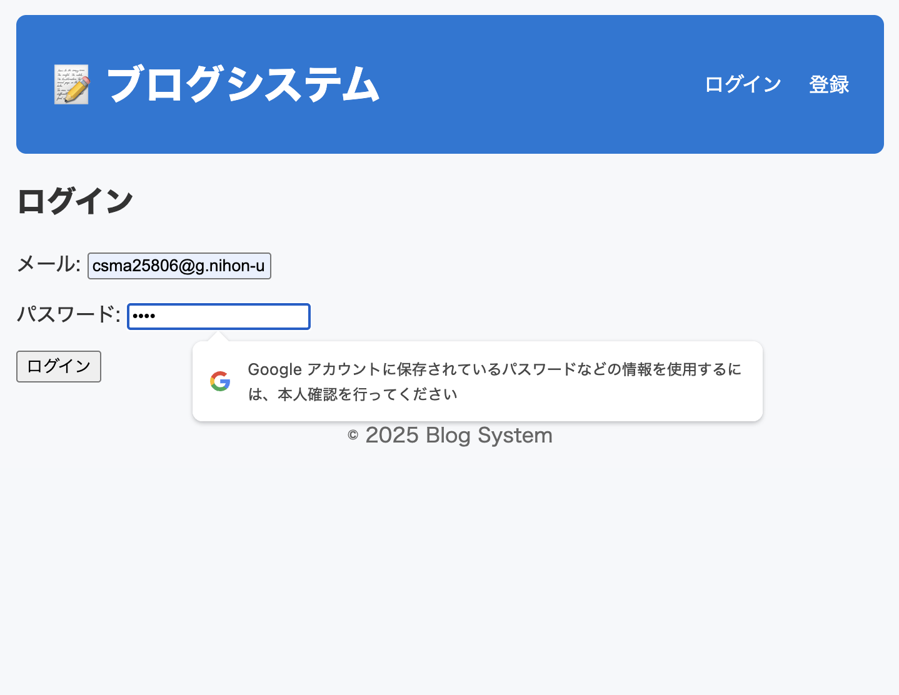
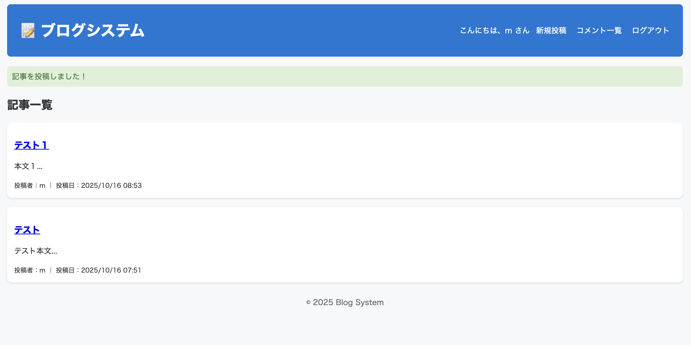
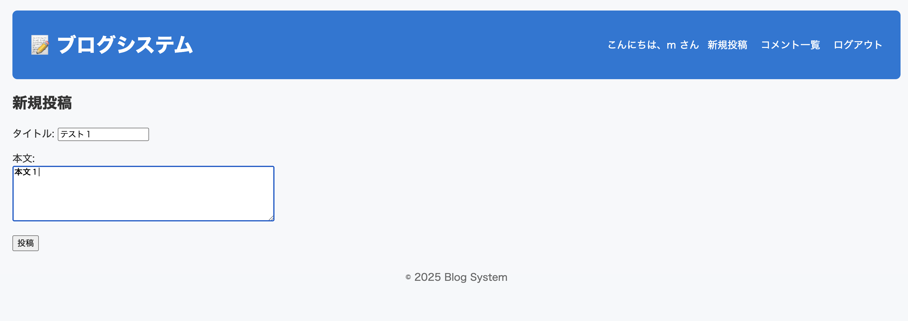
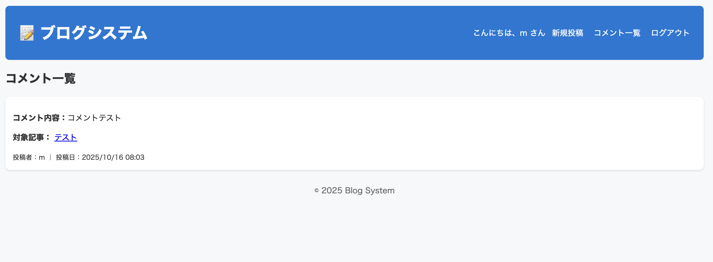

# 📝 Flask Blog System

## 📖 概要
本システムは、FlaskとSQLiteを用いて構築したWebアプリケーションです。  
ユーザ登録・ログイン機能を備え、ユーザが記事を投稿・編集でき、他のユーザがコメントを残すことができます。  
これにより、Webアプリ開発におけるサーバサイド処理・データベース連携・認証機構の基本構造を理解することを目的としています。

---

## ⚙️ 使用技術
| 分類 | 使用技術 |
|------|------------|
| 言語 | Python 3.x |
| フレームワーク | Flask |
| データベース | SQLite（SQLAlchemy使用） |
| 認証機能 | Flask-Login |
| フロントエンド | HTML / CSS (Jinja2テンプレートエンジン) |

---


---

## 🔐 ログイン画面


## 🧍‍♀️ メイン画面


## 📝 記事投稿画面


## 💬 コメント画面


---

## 💡 機能一覧
| 機能名 | 概要 |
|----------|--------|
| ユーザ登録 | 新規ユーザを登録し、認証情報をDBに保存 |
| ログイン／ログアウト | Flask-Loginを用いた認証機構 |
| 記事投稿 | タイトル・本文・投稿者をDBに保存 |
| 記事編集 | 投稿者本人のみが編集可能 |
| 記事一覧表示 | 全ユーザの記事を一覧表示 |
| コメント投稿 | 記事ごとにコメントを登録・表示 |
| データ管理 | SQLiteを使用して永続的に保存 |

---

## 🧠 学び・考察
- Flaskを用いたサーバサイドWebアプリケーション開発の基礎を理解できた。  
- テンプレートエンジン（Jinja2）を利用してHTML内で動的にデータを表示できるようになった。  
- Flask-Loginを利用することで、安全なユーザ認証機能を実装できた。  
- SQLiteを通してデータの永続化や、ORM（SQLAlchemy）の便利さを学んだ。  
- 今後は画像投稿や検索機能を追加し、より実用的なブログシステムを目指したい。

---

## 📎 動作方法
ローカル環境で実行する場合は以下のコマンドを使用します：

```bash
# 仮想環境の起動
source venv/bin/activate

# サーバ起動
python3 app.py
起動後、ブラウザで以下のURLにアクセス：
👉 http://127.0.0.1:5000
